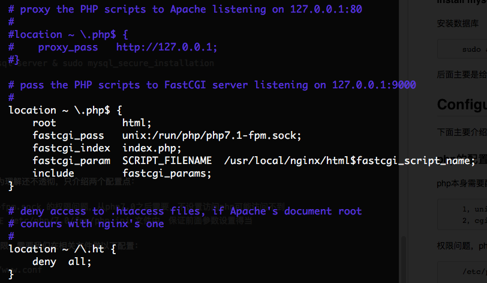
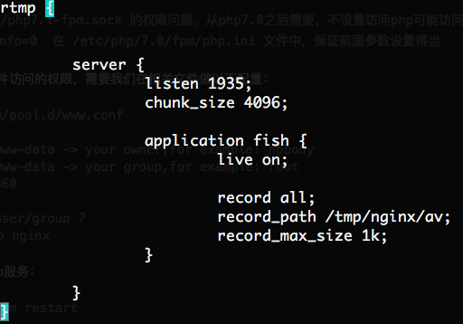

#Points:
1,Install softwares   
2,configure softwares ,including php ,rtmp  

--------------
UBUNTU 14.04 for example
==================
---------------

##Installing softwares 
nginx & php & rtmp & mysql

####install nginx
		一共有两种方式安装nginx，
		a，apt-get install nginx	
		b，从源代码安装
		
因为我们需要支持rtmp模块，所以必须从源代码安装，下面主要讲解这种方式的安装,命令如下(可能需要root权限)：
		
		1, wget http://nginx.org/download/nginx-1.7.5.tar.gz  //downloading nginx source code
		2, wget https://github.com/arut/nginx-rtmp-module/archive/master.zip  //downloading rtmp module
		3, tar -zxvf nginx-1.7.5.tar.gz & unzip master.zip  //unzip/unrar all files
		4, ./configure --with-http_ssl_module --add-module=../nginx-rtmp-module-master  //configure
		5, make & make install 
上面是一个标准的源代码软件安装方式，nginx可以从[官网](http://nginx.org/en/download.html)下载最新的代码 ,rtmp模块的可以参考[官方GIT](https://github.com/arut/nginx-rtmp-module)。   

增加nginx服务启动方式：
		
		sudo wget https://raw.github.com/JasonGiedymin/nginx-init-ubuntu/master/nginx -O /etc/init.d/nginx
		sudo chmod +x /etc/init.d/nginx
		sudo update-rc.d nginx defaults
上述设置完毕后，我们就可以已服务的方式启动nginx：

		service nginx start //开启
		service nginx stop //关闭，也可以 killall nginx
		service nginx restart  //重启服务

####install php
安装php可以直接从apt源安装，如果缺少源，自己Google下获取   

		sudo apt-get install php-fpm php-mysql 
可能需要添加源：

		sudo apt-add-repository ppa:ondrej/php & sudo apt-get update
		

#### install mysql
安装数据库

		sudo apt-get install mysql-server & sudo mysql_secure_installation
		
后面主要是给数据库设置密码。

##Configure
下面主要介绍配置php和rtmp

###php的配置
php本身需要配置的其实不是必须的，因为理解还不透彻，只介绍两个配置点：
		
		1，unix://run/php/php7.1-fpm.sock 的权限问题，从php7.0之后需要，不设置访问php可能访问不到
		2，cgi.fix_pathinfo=0  在 /etc/php/7.0/fpm/php.ini 文件中，保证前面参数设置得当
		
1，权限问题，php增强了sock文件访问的权限，需要我们在相关文件做以下配置：
		
		/etc/php/7.0/fpm/pool.d/www.conf
		
		listen.owner = www-data -> your owner,for example: nobody
		listen.group = www-data -> your group,for example: root
		listen.mode = 0660
		
		FAQ: find your user/group ?
			ps aux | grep nginx 

2，设置结束后，需要重新启动php服务：

		service php7.1-fpm restart

###nginx的配置
我们需要正确设置nginx，才能够帅nginx正确访问访问php和rtmp服务器，下面仅仅介绍最简单的设置。  
设置文件所在目录为  

		/usr/local/nginx/conf/nignx.config 
如果从apt-get安装，目录可能不同，参考 

		/etc/nginx/sites-available/default

为了跟踪错误，建议打开日志
		
		error_log logs/error_all.log warn;
		access_log logs/access.log;
默认配置文件把日志注释掉了，去掉#号，打开即可  

1，php的设置,下面贴图示例：  

  
	其实打开配置文件，默认注释掉了php相关部分，只要我们把注解打开，做微量的调整即可。本人做的调整有
	
		1，netstatus -a //找到自己的php-fpm的端口
		2，fastcgi_pass unix:/run/php/php7.1-fpm.sock  //这里填入上面的端口，不同PHP版本，有所差异
和

		fastcgi_param SCRIPT_FILENAME xxxx$fastcgi_script_name //将xxx换成自己的php目录	
	
上面提到php的权限问题，就是这里的unix sock端口。php7之后做了安全保护，默认没有权限访问，如果不做设置，就会包权限错误。好像还可以使用本地127.0.0.1:9000端口，但是测试失败。

2，rtmp的设置
这里官方GIT提供了更为详尽的教程，这里只贴出本人配置：

	
推流／拉流的时候，对应地址为 your_url:1935/fish/your_live_room_name_by_your_own_will

#参考
[很简洁的一个教程，赞](https://www.digitalocean.com/community/tutorials/how-to-install-linux-nginx-mysql-php-lemp-stack-in-ubuntu-16-04)	
[nginx官网](http://nginx.org/)		
[rtmp官方Git](https://github.com/arut/nginx-rtmp-module)  
[rtmp安装指南from VULTR](https://www.vultr.com/docs/setup-nginx-rtmp-on-ubuntu-14-04)  
	

[php权限错误的问题](https://stackoverflow.com/questions/23443398/nginx-error-connect-to-php5-fpm-sock-failed-13-permission-denied)	

			
	